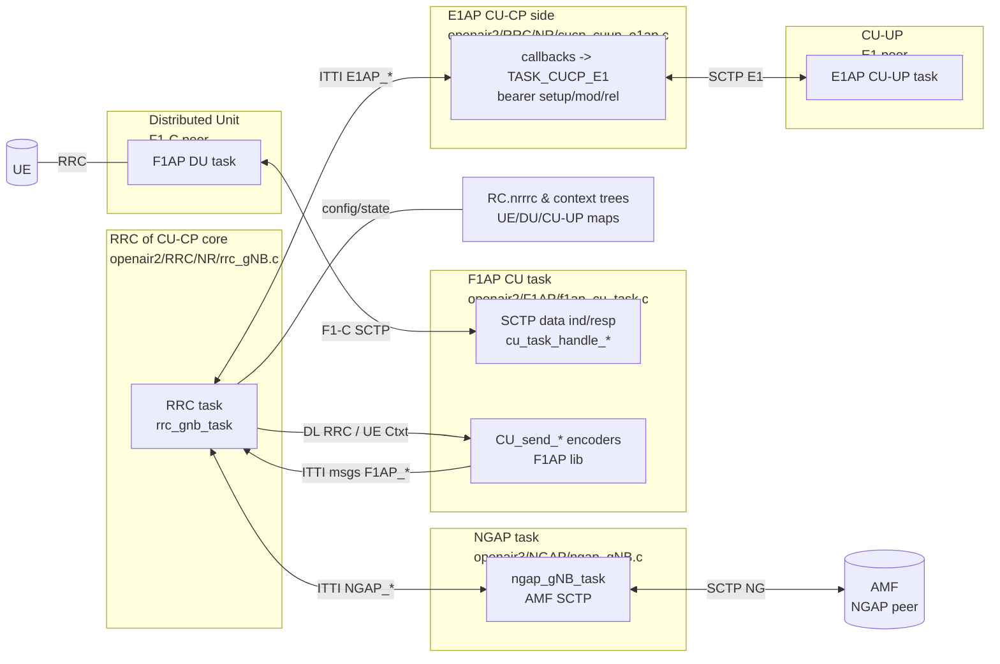

High-level CU-CP architecture in OAI (code inspection)
- Main control thread `rrc_gnb_task()` (`openair2/RRC/NR/rrc_gNB.c`) is single-threaded and processes ITTI messages from F1AP, E1AP, NGAP (and timers). It drives UE procedures and orchestrates CU-UP/DU/AMF interactions.
- F1 control: `F1AP_CU_task()` (`openair2/F1AP/f1ap_cu_task.c`) runs an ITTI thread handling SCTP events. It decodes F1 PDUs via `f1ap_handle_message()` and forwards ITTI messages (e.g., `F1AP_SETUP_REQ`, `F1AP_UL_RRC_MESSAGE`) to RRC; downlink messages from RRC are encoded and sent over SCTP here.
- E1 interface (CU-CP <-> CU-UP): CU-CP registers callbacks in `cucp_cuup_e1ap_init()` (`openair2/RRC/NR/cucp_cuup_e1ap.c`) so RRC can push bearer context setup/mod/rel ITTI messages to the E1 task (`TASK_CUCP_E1`). CU-UP signalling is handled by RRC functions in `rrc_gNB_cuup.c`.
- NG interface (CU-CP <-> AMF): NGAP module in `openair3/NGAP` runs `ngap_gNB_task()` which manages SCTP to AMF and exchanges NGAP ITTI messages with RRC (NAS transport, context setup/release, HO).
- Data-plane split awareness: CU-CP keeps DU list (F1-C), CU-UP list (E1), and UE mappings to DU/CU-UP (`f1ap_ids.c`). GTP-U is started in `F1AP_CU_task` only when running integrated CU (no E1); otherwise CU-UP handles UP.
- Reference docs: `doc/F1AP/F1-design.md` (thread model, F1 message routing), `doc/E1AP/E1-design.md` (CUCP<->CUUP procedures, callbacks), `doc/RRC/rrc-dev.md` (RRC procedures from CU-CP view).

# Map of CU-CP

Component notes
- RRC task: single-threaded CU-CP brain; dispatches F1AP/NGAP/E1AP ITTI, maintains UE/DU/CU-UP trees and triggers RRC/PDCP/HO procedures.
- F1AP CU task: SCTP listener + encoder/decoder; translates between SCTP and ITTI (`F1AP_*`) for DU signalling; starts GTP-U only in integrated mode.
- E1AP CU-CP side: callback shim registering `bearer_context_*` senders into E1 task so RRC can drive CU-UP bearer lifecycle.
- NGAP task: manages AMF associations, NG Setup, NAS transport, context setup/release, and HO messaging; exchanges ITTI with RRC.
- Context storage: global `RC.nrrrc[0]` holds RRC instance with trees for UE contexts, DUs, CU-UPs; `f1ap_ids.c` maps CU UE IDs to DU/CU-UP assoc IDs and DU UE IDs.
