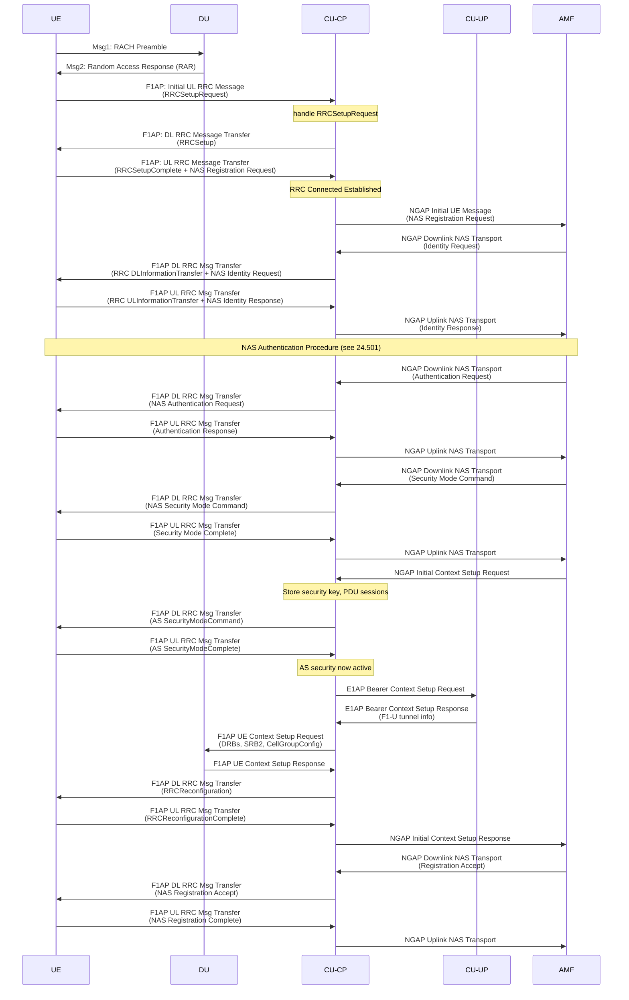
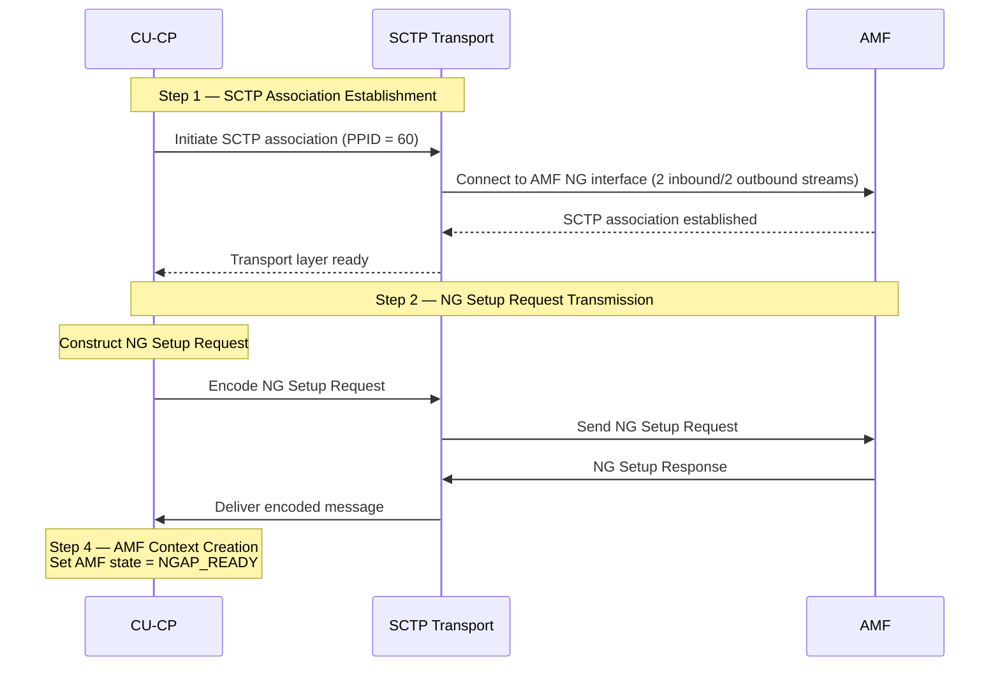
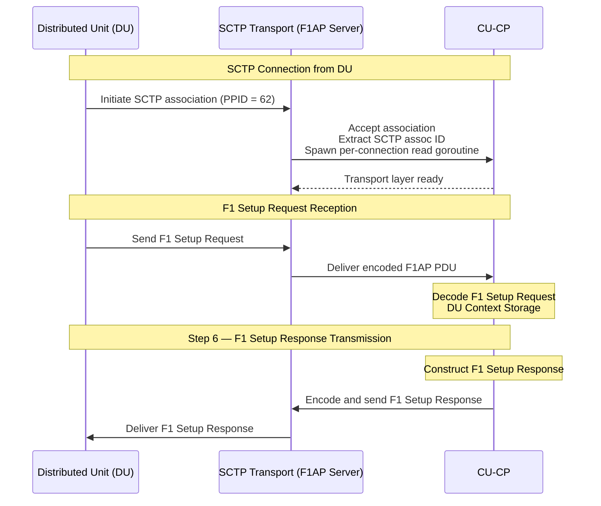

ue registration procedure

```mermaid
sequenceDiagram
  participant ue as UE
  participant du as DU
  participant cucp as CU-CP
  participant cuup as CU-UP
  participant amf as AMF

  %% --- RACH + RRC Connection Establishment ---
  ue->>du: Msg1: RACH Preamble
  du->>ue: Msg2: Random Access Response (RAR)

  ue->>cucp: F1AP: Initial UL RRC Message<br/>(RRCSetupRequest)
  note over cucp: handle RRCSetupRequest

  cucp->>ue: F1AP: DL RRC Message Transfer<br/>(RRCSetup)
  ue->>cucp: F1AP: UL RRC Message Transfer<br/>(RRCSetupComplete + NAS Registration Request)
  note over cucp: RRC Connected Established

  %% --- NGAP Initial UE Message ---
  cucp->>amf: NGAP Initial UE Message<br/>(NAS Registration Request)
  
  %% --- Identity Request (if needed) ---
  amf->>cucp: NGAP Downlink NAS Transport<br/>(Identity Request)
  cucp->>ue: F1AP DL RRC Msg Transfer<br/>(RRC DLInformationTransfer + NAS Identity Request)
  ue->>cucp: F1AP UL RRC Msg Transfer<br/>(RRC ULInformationTransfer + NAS Identity Response)
  cucp->>amf: NGAP Uplink NAS Transport<br/>(Identity Response)
  
  %% --- NAS Authentication ---
  Note over amf,ue: NAS Authentication Procedure (see 24.501)
  amf->>cucp: NGAP Downlink NAS Transport<br/>(Authentication Request)
  cucp->>ue: F1AP DL RRC Msg Transfer<br/>(NAS Authentication Request)

  ue->>cucp: F1AP UL RRC Msg Transfer<br/>(Authentication Response)
  cucp->>amf: NGAP Uplink NAS Transport

  %% --- NAS Security Mode ---
  amf->>cucp: NGAP Downlink NAS Transport<br/>(Security Mode Command)
  cucp->>ue: F1AP DL RRC Msg Transfer<br/>(NAS Security Mode Command)

  ue->>cucp: F1AP UL RRC Msg Transfer<br/>(Security Mode Complete)
  cucp->>amf: NGAP Uplink NAS Transport

  %% --- Initial Context Setup ---
  amf->>cucp: NGAP Initial Context Setup Request
  note over cucp: Store security key, PDU sessions
  
  %% --- AS Security Mode (if not already active) ---
  cucp->>ue: F1AP DL RRC Msg Transfer<br/>(AS SecurityModeCommand)
  ue->>cucp: F1AP UL RRC Msg Transfer<br/>(AS SecurityModeComplete)
  note over cucp: AS security now active
  
  %% --- E1AP Bearer Setup (if PDU sessions exist) ---
  cucp->>cuup: E1AP Bearer Context Setup Request
  cuup->>cucp: E1AP Bearer Context Setup Response<br/>(F1-U tunnel info)
  
  %% --- F1AP UE Context Setup ---
  cucp->>du: F1AP UE Context Setup Request<br/>(DRBs, SRB2, CellGroupConfig)
  du->>cucp: F1AP UE Context Setup Response

  %% --- RRC Reconfiguration (SRB setup) ---
  cucp->>ue: F1AP DL RRC Msg Transfer<br/>(RRCReconfiguration)
  ue->>cucp: F1AP UL RRC Msg Transfer<br/>(RRCReconfigurationComplete)

  %% --- Complete Registration ---
  cucp->>amf: NGAP Initial Context Setup Response
  amf->>cucp: NGAP Downlink NAS Transport<br/>(Registration Accept)
  cucp->>ue: F1AP DL RRC Msg Transfer<br/>(NAS Registration Accept)

  ue->>cucp: F1AP UL RRC Msg Transfer<br/>(NAS Registration Complete)
  cucp->>amf: NGAP Uplink NAS Transport
```

```mermaid
sequenceDiagram
    participant CU as CU-CP
    participant SCTP as SCTP Transport
    participant AMF as AMF

    %% Step 1: SCTP Association Establishment
    Note over CU,SCTP: Step 1 — SCTP Association Establishment
    CU->>SCTP: Initiate SCTP association (PPID = 60)
    SCTP->>AMF: Connect to AMF NG interface (2 inbound/2 outbound streams)
    AMF-->>SCTP: SCTP association established
    SCTP-->>CU: Transport layer ready

    %% Step 2: NG Setup Request
    Note over CU,AMF: Step 2 — NG Setup Request Transmission
    Note over CU: Construct NG Setup Request
    CU->>SCTP: Encode NG Setup Request
    SCTP->>AMF: Send NG Setup Request

    %% Step 3: NG Setup Response
    AMF->>SCTP: NG Setup Response
    SCTP->>CU: Deliver encoded message

    %% Step 4: AMF Context Creation
    Note over CU: Step 4 — AMF Context Creation<br/>Set AMF state = NGAP_READY
```

```mermaid
sequenceDiagram
    participant DU as Distributed Unit (DU)
    participant SCTP as SCTP Transport (F1AP Server)
    participant CU as CU-CP

    %% Step 1: SCTP Connection
    Note over DU,CU: SCTP Connection from DU
    DU->>SCTP: Initiate SCTP association (PPID = 62)
    SCTP->>CU: Accept association<br/>Extract SCTP assoc ID<br/>Spawn per-connection read goroutine
    CU-->>SCTP: Transport layer ready

    %% Step 2: F1 Setup Request
    Note over DU,CU: F1 Setup Request Reception
    DU->>SCTP: Send F1 Setup Request
    SCTP->>CU: Deliver encoded F1AP PDU
    Note over CU: Decode F1 Setup Request<br/>DU Context Storage

    %% Step 6: F1 Setup Response
    Note over DU,CU: Step 6 — F1 Setup Response Transmission
    Note over CU: Construct F1 Setup Response
    CU->>SCTP: Encode and send F1 Setup Response
    SCTP->>DU: Deliver F1 Setup Response
```